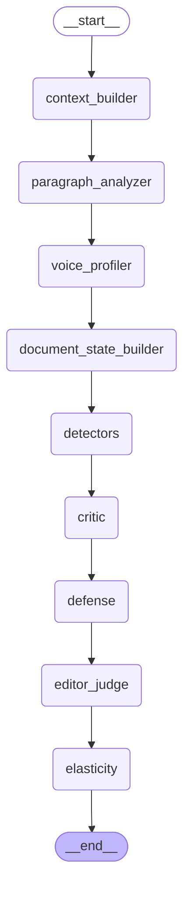

# Chunk Pipeline DAG

```mermaid
---
config:
  flowchart:
    curve: linear
---
graph TD;
	__start__([<p>__start__</p>]):::first
	context_builder(context_builder)
	paragraph_analyzer(paragraph_analyzer)
	voice_profiler(voice_profiler)
	document_state_builder(document_state_builder)
	detectors(detectors)
	critic(critic)
	defense(defense)
	editor_judge(editor_judge)
	elasticity(elasticity)
	__end__([<p>__end__</p>]):::last
	__start__ --> context_builder;
	context_builder --> paragraph_analyzer;
	critic --> defense;
	defense --> editor_judge;
	detectors --> critic;
	document_state_builder --> detectors;
	editor_judge --> elasticity;
	paragraph_analyzer --> voice_profiler;
	voice_profiler --> document_state_builder;
	elasticity --> __end__;
	classDef default fill:#f2f0ff,line-height:1.2
	classDef first fill-opacity:0
	classDef last fill:#bfb6fc

```
