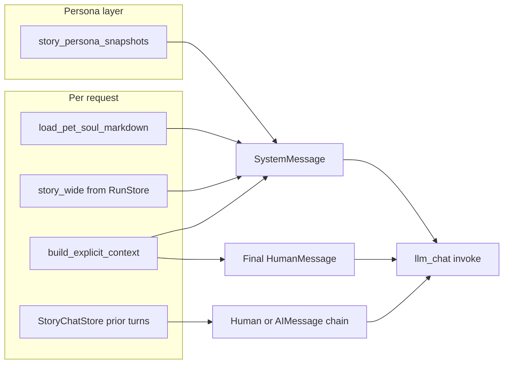

# Example: Inkblot persona snapshots and message assembly

[← Wiki home](../README.md) · [Context systems](../context-systems.md) (§3)

## Provenance

**Persona snapshot from local `editr.sqlite` (2026-04-08):**

- `document_id`: `cb2de571-797d-454e-aa1d-84cb9313cfd4`
- `version`: `11` (table `story_persona_snapshots`)

**Story-chat turn (manifest sample):** table `story_chat_turns`, session `0519afa5-54a2-493c-884e-3814fb9e2a25`, assistant turn with `context_manifest_json` referencing a chapter segment scope.

Persona and pipeline samples may refer to **different** runs or revisions; that is normal—Inkblot always reads the **latest** persona row for the document and the **current** explicit context for the requested revision/chunks.

## Deterministic persona JSON (excerpt)

Fields are produced by [`build_deterministic_persona`](../../../src/narrative_dag/persona/engine.py) and stored in `deterministic_json`:

```json
{
  "document_id": "cb2de571-797d-454e-aa1d-84cb9313cfd4",
  "revision_id": "eea6f6ed-dc59-4872-8e38-93f11bf4be18",
  "source_run_id": "cc288fa8-b8ca-4b90-8e46-0891baa67520",
  "state": "active",
  "genre": "literary_horror",
  "analyzed_word_estimate": 1467,
  "chunk_count": 5,
  "plot_blurb": "The story is about a stalled, self-mythologizing man whose resentment…",
  "cast_names": ["Dennis", "Joe", "Brenda", "Bev", "older female customer", "mysterious suited man"],
  "soul_sections": {
    "CoreIdentity": "You are Inkblot, a small attentive companion…",
    "CareGoals": "Help the writer see structure…",
    "DoNotDo": "Do not shame the writer…"
  },
  "narrative_map_len": 5,
  "emotional_curve_len": 5
}
```

## `pet_style_policy_json` and `llm_snapshot_json` (excerpt)

- **Style policy** includes `response_voice.summary` (voice layers merged from `DocumentState.voice_baseline`).
- **LLM snapshot** includes `one_liner`, `alignment_notes`, `tone_reminders`, and optional `visual_model` (avatar SVG path, colors).

Example `one_liner` + start of `alignment_notes` from the same row:

```text
one_liner: "A sharp-eyed, slightly sardonic companion for a story where everyday resentment cracks open into uncanny horror."
alignment_notes: "Emphasize deadpan clarity, structural insight, and the uneasy collision between banal workplace realism and surreal intrusion…"
```

## Soul markdown vs `_system_prompt`

[`load_pet_soul_markdown`](../../../src/narrative_dag/pet_soul.py) loads [`PET_SOUL.md`](../../pet/PET_SOUL.md) (and optional per-document override). [`_system_prompt`](../../../src/narrative_dag/story_chat.py) parses sections with [`parse_soul_sections`](../../../src/narrative_dag/pet_soul.py) and injects only:

- `CoreIdentity`, or if missing, `Preamble`
- `CareGoals`
- `DoNotDo`

Headings such as **`VoiceIntent`** and **`FirstHelloStyle`** in the markdown file are **not** included in the system prompt unless you fold their text into those three sections or extend the code.

## `story_chat_turns.context_manifest_json` (sample)

Explicit context for one turn (chapter segment scope):

```json
{
  "revision_id": "218a838b-bcfc-4879-8cd3-4cce498a054b",
  "document_id": "cb2de571-797d-454e-aa1d-84cb9313cfd4",
  "scope": "chapter_segment",
  "chapter_id": "c3abaf97-4e02-40e8-be20-47bca061b3fa",
  "chapter_title": "Short Story",
  "chapter_index": 0,
  "segment_char_start": 0,
  "segment_char_end": 7982,
  "word_limit": 5000,
  "truncated": false,
  "approx_word_count": 1467
}
```

## LangChain message assembly

[`run_inkblot_chat`](../../../src/narrative_dag/story_chat.py) builds:

1. **One `SystemMessage`** — template in `_system_prompt` with character limits:

   | Segment | Cap (chars) |
   |---------|-------------|
   | Core soul block | 2000 / 1500 / 1500 for core / care / don't |
   | `str(deterministic)` | 4000 |
   | Voice policy string | 2000 |
   | LLM snapshot bits | `one_liner` + `alignment_notes` |
   | `str(story_wide)` | 6000 |
   | `str(context_manifest)` | 2000 |

2. **`HumanMessage` / `AIMessage` chain** — `prior_turns` (last `STORY_CHAT_ACTIVE_TURNS` turns from history **before** the current request turn).

3. **Final `HumanMessage`** — manuscript excerpt up to **120000** characters, then `User message:` + user text (optionally prefixed with `[Earlier turns summary]` when history exceeds the window).

### Turn ordering (service)

In [`NarrativeAnalysisService.story_chat`](../../../src/narrative_dag/service.py):

1. `history_before = list_turns(session_id)` — state **before** this request.
2. `append_turn(..., role=user, ...)` — persist the new user message.
3. `prior_for_model = history_before[-STORY_CHAT_ACTIVE_TURNS:]` — rolling window of **prior** turns only; the **current** user text is **not** duplicated inside `prior_turns`; it appears only in the final user message body passed to `run_inkblot_chat`.



## Related code

- [`story_chat.py`](../../../src/narrative_dag/story_chat.py)
- [`explicit_context.py`](../../../src/narrative_dag/explicit_context.py)
- [`persona_store.py`](../../../src/narrative_dag/store/persona_store.py)
